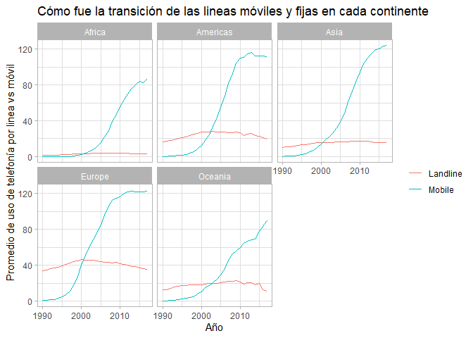

Uso Histórico de los teléfonos moviles vs tradicionales
================

## Análisis del uso de los teléfonos, cable y liena, a lo largo del tiempo.

Fuente: Hannah Ritchie (2017) - “Technology Adoption”. Publicado online
en OurWorldInData.org. Obtenido de:
‘<https://ourworldindata.org/technology-adoption>’ \[Online Resource\]

#### Librerias a utilizar

``` r
library(tidyverse)
```

    ## -- Attaching packages --------------------------------------- tidyverse 1.3.0 --

    ## v ggplot2 3.3.3     v purrr   0.3.4
    ## v tibble  3.0.4     v dplyr   1.0.2
    ## v tidyr   1.1.2     v stringr 1.4.0
    ## v readr   1.4.0     v forcats 0.5.0

    ## -- Conflicts ------------------------------------------ tidyverse_conflicts() --
    ## x dplyr::filter() masks stats::filter()
    ## x dplyr::lag()    masks stats::lag()

``` r
library(scales)
```

    ## 
    ## Attaching package: 'scales'

    ## The following object is masked from 'package:purrr':
    ## 
    ##     discard

    ## The following object is masked from 'package:readr':
    ## 
    ##     col_factor

``` r
theme_set(theme_light())
```

``` r
# Cargamos la data directamente desde el link en formato ".csv"


mobile <- readr::read_csv('https://raw.githubusercontent.com/rfordatascience/tidytuesday/master/data/2020/2020-11-10/mobile.csv')
```

    ## 
    ## -- Column specification --------------------------------------------------------
    ## cols(
    ##   entity = col_character(),
    ##   code = col_character(),
    ##   year = col_double(),
    ##   total_pop = col_double(),
    ##   gdp_per_cap = col_double(),
    ##   mobile_subs = col_double(),
    ##   continent = col_character()
    ## )

``` r
landline <- readr::read_csv('https://raw.githubusercontent.com/rfordatascience/tidytuesday/master/data/2020/2020-11-10/landline.csv')
```

    ## 
    ## -- Column specification --------------------------------------------------------
    ## cols(
    ##   entity = col_character(),
    ##   code = col_character(),
    ##   year = col_double(),
    ##   total_pop = col_double(),
    ##   gdp_per_cap = col_double(),
    ##   landline_subs = col_double(),
    ##   continent = col_character()
    ## )

``` r
#La renombramos para organizar un poco los datos

mobile <- mobile %>%
    rename(suscripciones = mobile_subs)%>%
    mutate(type = "Mobile")

landline <- landline %>%
    rename(suscripciones = landline_subs)%>%
    mutate(type = "Landline")

phones <- bind_rows(mobile,landline) %>%
    rename(pais = entity)
```

creamos un filtro para analizar por país, en este caso cual es el uso de
la telefonia de linea vs la telefonia movil

``` r
#Organizamos la información empezamos por el país, año y las suscripciones.

phones%>%
    filter(pais == "Colombia") %>%
    ggplot(aes(year,suscripciones,color = type)) +
    ggtitle("Transición de la telefonía de cable a la mobíl en Colombia")+
    geom_line()
```

    ## Warning: Removed 2 row(s) containing missing values (geom_path).

<!-- -->

``` r
# Primer insigth: en donde encontramos mas de 100 porciento, que es luego del 2003, se sugiere que las personas empezaron a suscribirse a más de una línea telefónica.
    
phones %>% 
    arrange(desc(suscripciones))
```

    ## # A tibble: 13,251 x 8
    ##    pais      code   year total_pop gdp_per_cap suscripciones continent type  
    ##    <chr>     <chr> <dbl>     <dbl>       <dbl>         <dbl> <chr>     <chr> 
    ##  1 Macao     MAC    2016        NA      97752.          322. Asia      Mobile
    ##  2 Macao     MAC    2015        NA     100445.          316. Asia      Mobile
    ##  3 Macao     MAC    2014        NA     130755.          315. Asia      Mobile
    ##  4 Macao     MAC    2013    578844     135319.          299. Asia      Mobile
    ##  5 Macao     MAC    2012    567441     124569.          287. Asia      Mobile
    ##  6 Hong Kong HKG    2017        NA      56055.          249. Asia      Mobile
    ##  7 Macao     MAC    2011    555731     116752.          246. Asia      Mobile
    ##  8 Hong Kong HKG    2016        NA      54413.          241. Asia      Mobile
    ##  9 Hong Kong HKG    2013   7274125      51732.          237. Asia      Mobile
    ## 10 Hong Kong HKG    2014        NA      52789.          236. Asia      Mobile
    ## # ... with 13,241 more rows

``` r
Dim_pais<- phones%>%
    group_by(pais)%>%
    summarize(avg_pobl = mean(total_pop, na.rm = T)) %>%
    arrange(desc(avg_pobl))
```

    ## `summarise()` ungrouping output (override with `.groups` argument)

``` r
#veamos una comparacion de una grafica de lineas con las tendencias de todos los paises


# organizado por el top 10 de paises segun su poblacion 

phones %>%
    semi_join(Dim_pais %>% top_n(40, avg_pobl), by = "pais") %>%
    ggplot(aes(year,
               suscripciones,
               color =  type,
               group = interaction(type, pais))) +
    geom_line()+
    facet_wrap(~ continent)
```

    ## Warning: Removed 81 row(s) containing missing values (geom_path).

<!-- -->

\#Uso de los telefonos de linea vs movil mostrado segun su promedio por
continente.

``` r
phones %>%
    filter(!is.na(suscripciones))%>%
    group_by(year  , continent, type)%>%
    summarize(avg_suscripciones = mean(suscripciones),
              q25 = quantile(suscripciones,.25),
              q75 = quantile(suscripciones, .75))%>%
    ggplot(aes(year,
               avg_suscripciones,
               color = type))+
    geom_line()+
    facet_wrap(~ continent)+
    labs( x = "Año",
          y = "Promedio de uso de telefonía por linea vs móvil",
          color = "",
          title = "Cómo fue la transición de las lineas móviles y fijas en cada continente")
```

    ## `summarise()` regrouping output by 'year', 'continent' (override with `.groups` argument)

<!-- -->

``` r
# como segundo insigth podemos observar que usualmente las suscripciones de linas telefonicas se mantienen a lo largo de los años.


summarize_subscriptions <- . %>%
    filter(!is.na(suscripciones))%>%
    summarize(avg_suscripciones = mean(suscripciones),
              q25 = quantile(suscripciones,.25),
              q75 = quantile(suscripciones, .75))
```

Usamos la librería del WDI: World Development Indicators(World Bank)
para asosicar el fct\_relevel con la capacidad adquisitiva junto al
codigo de aréa de cada país

``` r
library(WDI)

country_incomes <- WDI(start = 2005, end = 2005, extra = T) %>%
    as_tibble() %>%
    #iso3c es el codigo de area
    select(code = iso3c, income)%>%
    filter(!is.na(income))%>%
    mutate(income = fct_relevel(income,"Low income", "Lower middle income","Upper middle income"))

by_year_income <-phones %>%
    inner_join(country_incomes,by = "code")%>%
     filter(!is.na(suscripciones))%>%
    group_by(year  , income, type)%>%
    summarize_subscriptions()
```

    ## `summarise()` regrouping output by 'year', 'income' (override with `.groups` argument)

``` r
by_year_income%>%
    ggplot(aes(year,
               avg_suscripciones,
               color = type))+
    geom_line()+
    facet_wrap(~ income)+
    labs( x = "Año",
          y = "promedio de suscripciones",
          color = "",
          title = "Promedio lineas vs móvil según la capacidad adquisitiva")
```

<!-- -->

``` r
#tercer insigt: podemos observar como los países con mayor ingresos, adquirieron e incorporaron primero la telefonía movil a lo largo de los años.


by_year_income <- phones %>% 
   inner_join(country_incomes, by = "code") %>%
    group_by(year, income, type)%>%
    summarize_subscriptions
```

    ## `summarise()` regrouping output by 'year', 'income' (override with `.groups` argument)

``` r
# Unimos en una sola gráfica el detalle de las lineas por promedio de ingresos

by_year_income %>%
    ggplot(aes(year,
               avg_suscripciones,
               color=income))+
    geom_line()+
    facet_wrap(~type ,ncol = 1)+
    labs(y = "Subscripciones promedio por cada 100 personas", color = "income", x= "Año")
```

<!-- -->
